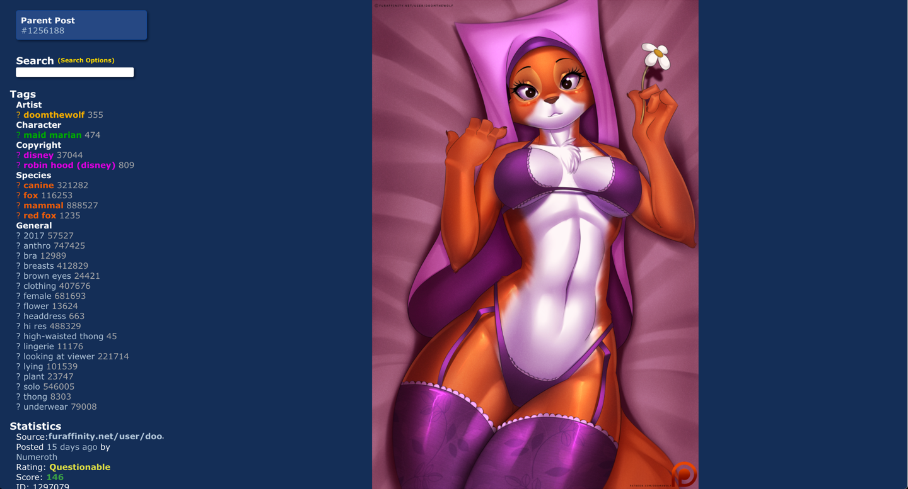

> # batx
> making e621 better
> 
> # How to use
> Alt-click on an image / link to open the improved version
> 
> That's literally all it does
> 
> Have fun
> 
> # How to install
> 
> - `script.user.js` is a tampermonkey script
> - `style.css` is a CSS file you need to inject with something, I use stylish
> 
> # Screenshot
> 
> (this is a random post I found while looking for a quick example)

Contact me for more details, the version in this repo is both outdated and unsupported
